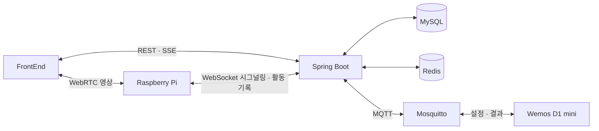

# ganadiCare · BackEnd

반려동물의 일상을 원격으로 살피고 급식·급수와 활동 기록을 관리하는 **ganadiCare**의 Spring Boot 서버입니다.
프로젝트 내부 애플리케이션 이름은 `HomeCam`입니다.

[조직 소개](https://github.com/ganadiCare) · [FrontEnd](https://github.com/ganadiCare/FrontEnd) · [Sensor](https://github.com/ganadiCare/Sensor)

## 주요 기능

| 영역 | 구현 기능 |
| --- | --- |
| 회원 | 이메일 인증, 회원가입·로그인, JWT 재발급, 프로필·닉네임·비밀번호 관리 |
| 반려동물 | 반려동물 정보 조회·수정·삭제 |
| 카메라 | 카메라 설정, WebRTC 시그널링, TURN 접속 정보 제공 |
| 급식·급수 | 급식 예약과 자동 급수 설정, MQTT 장치 연동, 공급·잔량 기록 |
| 기록 | 활동 로그 조회, 녹화 파일 업로드·목록·다운로드·삭제 |
| 리포트 | AI 리포트 생성·조회 및 메모 관리 |
| 알림 | 급식·급수 완료 SSE 알림 |

## 시스템 구성



서버는 영상 연결을 위한 시그널링을 중계합니다. 영상은 WebRTC로 전송되며 네트워크 환경에 따라 TURN 릴레이를 사용합니다.
현재 시그널링은 단일 Pi 세션, MQTT는 공통 `homecam/*` 토픽을 사용하는 구조입니다.

## 기술 스택

- Java 17 · Spring Boot 4.0.5 · Gradle Wrapper
- Spring Web · Spring Security · JWT · Spring Data JPA
- MySQL · Redis · SMTP
- WebSocket · SSE · Eclipse Paho MQTT
- Docker · GitHub Actions · Azure VM

## 실행 방법

### 1. 사전 준비

JDK 17, MySQL, Redis 및 접근 가능한 MQTT 브로커가 필요합니다.
메일·AI 리포트·TURN 기능에는 해당 서비스의 접속 정보도 설정합니다.
MySQL에 사용할 데이터베이스를 먼저 생성하세요.

### 2. 환경변수

`dev` 프로필은 아래 환경변수를 사용합니다. 비밀 값은 저장소에 커밋하지 마세요.

| 변수 | 용도 |
| --- | --- |
| `DB_URL` | JDBC URL, 예: `jdbc:mysql://localhost:3306/homecam` |
| `DB_USER`, `DB_PW` | 데이터베이스 계정 |
| `REDIS_HOST` | Redis 호스트, 포트는 6379 |
| `MAIL_USERNAME_1`, `MAIL_PASSWORD_1` | SMTP 인증 정보 |
| `JWT_SECRET_KEY` | JWT 서명 키 |
| `JWT_ACCESS_EXPIRATION`, `JWT_REFRESH_EXPIRATION` | 토큰 유효기간, 밀리초 단위 |
| `GPT_API_KEY` | AI 리포트 API 키 |
| `TURN_SECRET` | TURN 임시 자격 증명 생성용 공유 비밀 |
| `MQTT_BROKER_URL` | 예: `tcp://localhost:1883` |
| `MQTT_USERNAME`, `MQTT_PASSWORD` | 브로커 인증 정보 |
| `MQTT_CLIENT_ID` | 서버 MQTT 클라이언트 ID |

터미널 또는 IDE 실행 설정에 변수를 등록한 뒤 실행합니다. Gradle 실행 시 `.env` 파일은 자동으로 읽히지 않습니다. Docker Compose는 `env_file` 설정으로 `.env`를 읽습니다.

```sh
# macOS / Linux
./gradlew bootRun --args='--spring.profiles.active=dev'
```

```powershell
# Windows PowerShell
.\gradlew.bat bootRun --args="--spring.profiles.active=dev"
```

기본 HTTP 포트는 8080입니다. 녹화 저장 경로는 기본 `/app/recordings`이며, 로컬에서는 `RECORDING_STORAGE_PATH`로 쓰기 가능한 경로를 지정할 수 있습니다.
`ddl-auto: update`가 설정되어 있으므로 실행 대상 데이터베이스를 확인하세요.

### 3. 빌드 및 테스트

```sh
./gradlew test
./gradlew bootJar
```

테스트 실행에는 테스트가 요구하는 환경변수와 외부 서비스 설정이 필요할 수 있습니다.

## API와 실시간 통신

| 경로 | 역할 |
| --- | --- |
| `/api/v1/members` | 인증·회원 관리 |
| `/api/v1/pets` | 반려동물 정보 |
| `/api/v1/cameras` | 카메라 설정 |
| `/api/v1/dispensers` | 급식기 설정·예약·로그 조회 |
| `/api/v1/logs` | 급식·급수 로그 등록 |
| `/api/v1/activities` | 활동 기록 |
| `/api/v1/recordings` | 녹화 파일 관리 |
| `/api/v1/reports` | 리포트 관리 |
| `/api/v1/webrtc/turn-credentials` | TURN 접속 정보 |
| `/api/v1/notifications/stream` | SSE 구독 |
| `/ws/signal` | WebSocket 시그널링 |

보호된 HTTP API에는 `Authorization: Bearer <accessToken>` 헤더가 필요합니다.
Swagger 관련 설정과 의존성이 포함되어 있으며 UI 경로는 `/swagger-ui/index.html`, OpenAPI 경로는 `/v3/api-docs`입니다. 런타임 제공 여부는 실행 환경에서 확인하세요.

MQTT 토픽, 메시지 흐름, 브로커 ACL은 [MQTT_SETUP.md](MQTT_SETUP.md)를 참고하세요.

## 코드 구조

```text
src/main/java/smCapstone/homecam/
├── domain/       # member, pet, device, activity, report
└── global/       # security, mqtt, websocket, webrtc, notification, gpt 등
src/main/resources/
├── application.yml
└── application-dev.yml
```

## 배포

`develop` 브랜치 push 시 GitHub Actions가 JAR 빌드, Docker 이미지 배포, Azure VM 갱신을 수행합니다.
설정은 [.github/workflows/develop.yml](.github/workflows/develop.yml)에 있습니다.
현재 워크플로는 `bootJar -x test`를 사용하므로 테스트는 별도로 실행해야 합니다.

[docker-compose.yml](docker-compose.yml)은 사전 빌드한 HomeCam 이미지와 Redis를 실행합니다. MySQL·MQTT·TURN은 별도 준비가 필요하며, 서버 컨테이너는 host 네트워크를 사용합니다.

## 커밋 규칙

| 태그 | 용도 |
| --- | --- |
| `feat` | 기능 추가 |
| `fix` | 버그 수정 |
| `docs` | 문서 변경 |
| `test` | 테스트 변경 |
| `style` | 코드 형식 |
| `refactor` | 리팩토링 |
| `perf` | 성능 개선 |
| `ci` | CI 설정 |
| `chore` | 기타 작업 |
| `remove` | 코드·파일 제거 |
